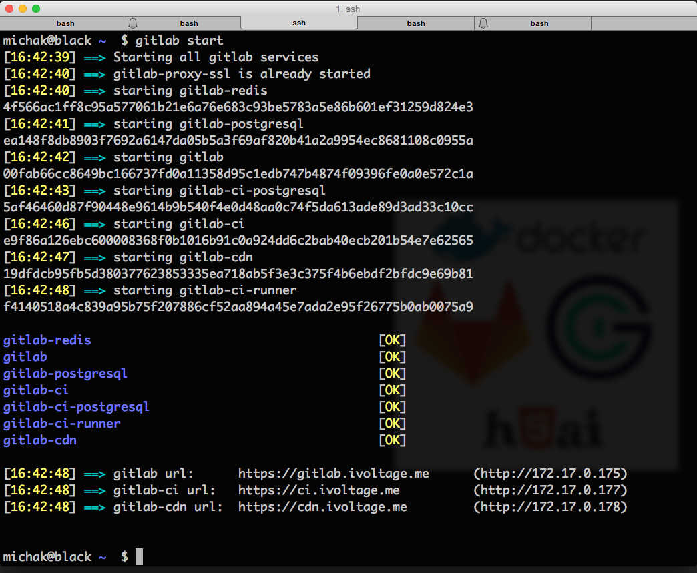

# michaKFromParis/gitlab-docker-sandwich

- [gitlab](https://gitlab.com) + [gitlab-ci](https://about.gitlab.com/gitlab-ci/) + [h5ai](https://larsjung.de/h5ai/) cdn to distribute your builds automatically.

- Easy upgrade, simple backup, tested restore

- Large repositories support over https

- Self signed certificates support and automatic generation

- Multiple instance support made easy

- Simple gmail email notifications


# Why ?

Running one or several instances of gitlab can be quite tedious and eat your precious time into boring admin tasks and command lines you don't really want to remember. Upgrades, backups and restores can be stressful if not a disaster. gitlab-ci does not offer a way to distribute your builds beautifully over the web.

# How ?

This script makes extensive use of the remarkably well maintained docker images from [sameersbn](https://github.com/sameersbn) and puts them all together into a complete solution

## Requirements

- [docker](https://docker.com)

## Quickstart

After editing **gitlab.conf**

``` bash
gitlab start
```



## Usage

``` bash
Usage: gitlab -hv [start | stop | restart | status | setup-runner | start-runner | stop-runner | wipe-runner | backup | upgrade | restore | cleanup | destroy ]

installs if necessary and runs gitlab, gitlab-ci & gitlab-ci-runner through docker
all services run on port 80 and are hidden behind an nginx ssl reverse proxy running on 443
all the docker containers will be prefixed by "gitlab"
configuration can be edited in gitlab.conf

Options

  -h		Print this help
  -v		Print verbose debugging

Actions

  start			Starts all services
  stop			Stops all services
  restart		Restarts all services
  status		Prints a status report of all services
  setup-runner	Runs the gitlab-ci-runner setup interactively to register him with gitlab-ci
  start-runner	Starts the gitlab-ci-runner
  stop-runner	Stops the gitlab-ci-runner
  wipe-runner	Removed all the gitlab-ci-runner data by remounting its tmpfs
  backup		Backup all gitlab, gitlab-ci & gitlab-ci-runner data
  upgrade		Upgrade gitlab, gitlab-ci & gitlab-ci-runner
  restore		Restore gitlab, gitlab-ci & gitlab-ci-runner data
  cleanup		Remove all named docker containers
  detroy		Remove all data permanently. Dangerous
```

## Configuration

All gitlab.conf variables are documented with comments directly in the file

###  Basics & Paths
 
- **protocol**='https'

	Valid values are **http** or **https**

- **dataRoot**='/data/gitlab'

	Data root directory all the data, builds, cdn for each instance

- **dataDirectory**="$dataRoot/data"

	Data directory of the gitlab, gitlab-ci, gitlab-ci-runner, postgresql data that needs to be backed up

- **buildsDirectory**="$dataRoot/builds"

	Directory mounted as a tmpfs locally and as the destination of all builds for gitlab-ci-runner

- **cdnDirectory**="$dataRoot/cdn"
	
	Directory containing all the builds results exposed as cdn with h5ai

- **backupDirectory**="$dataDirectory/gitlab/backups"
	
	Directory containing all the gitlab backups

- **timezone**="Europe/Paris"

	System timezone to set on all containers

- **gitlabTimezone**="Paris"

	gitlab timezone to set on gitlab and gitlab-ci. To see all available zones, run `bundle exec rake time:zones:all RAILS_ENV=production`

- **sudo**=false
	
	Should the script prepand root commands with a sudo ?
	

###  SSL Settings

- **sslKeysDirectory**="$dataDirectory/certs"

  Directory containing all the ssl keys

- **SSLKeyPrefix**="company.com"
  
  SSL filename prefix for .key & .crt

- **SSLVirtualHost**="*.company.com"

  SSL Wildcard top level domain to hosting all the subdomains

- **SSLEmail**="contact@company.com"

  SSL Contact email

- **SSLPassword**="test"

  SSL password (4 to 8191 characters)

- **SSLCountryCode**="FR"

  SSL certificate country code

- **SSLState**="Idf"
  
  SSL certificate state

- **SSLCity**="Paris"

  SSL certificate city

- **SSLCompany**="iVoltage"

  SSL certificate organization

- **SSLUnit**="www"

  SSL certificate unit

###  NGinx SSL Proxy

- **startNGinxProxy**=true

  Let gitlab-docker-sandwich start its own NGinx SSL Proxy. If you are already running an nginx ssl proxy docker image from jwilder, set it to false and set the sslProxyContainerName variable to its name

- **sslProxyClientMaxBodySize**='1024M'

  NGinX Client Max Body Size. Set it to a high value if you get this error:

  `Push Error: RPC failed; result=22, HTTP code = 413`

- **sslProxyClientBodyBufferSize**='2M'

  NGinX Client Body Buffer Size. Set it to a high value if you already
  defined a high value for sslProxyClientMaxBodySize

- **sslProxyContainerName**='gitlab-proxy-ssl'

  ssl reverse proxy container name

- **nginxProxySslImage**='jwilder/nginx-proxy'
  
  nginx ssl reverse proxy image name

###  Gitlab

- **gitlabVirtualHost**='gitlab.company.com'

  gitlab url

- **gitlabImage**='sameersbn/gitlab:7.14.1'

  gitlab docker image

- **gitlabSSHPort**=22

  the ssh port reserved for git ssh communication with gitlab.

  This port be exposed to the outside world and must be unique among gitlab-docker-sandwich instances

- **gitlabDatabasePassword**='fdsdasa#$#4528!d'

  gitlab postgresql root password

- **gitlabEmail**='gitlab.company.com@gmail.com'

  gitlab email address. Default configuration is setup to point to a gmail account

- **gitlabEmailPassword**='dsfdsfddsf43543$%$%'

  gitlab email password

- **unicornTimeout**='60000'

  maximum time for a gitlab operation over http to complete (includes git operations)

  Increase this value if you get the following error:

  `error: RPC failed; result=18, HTTP code = 200GiB | 32.21 MiB/s
  fatal: The remote end hung up unexpectedly
  fatal: early EOF
  fatal: index-pack failed
  the unicorn configuration file is located at /home/git/gitlab/config/unicorn.rb`

- **additionalGitlabParameters**="-e OAUTH_ENABLED=true -e OAUTH_ALLOW_SSO=true -e OAUTH_BLOCK_AUTO_CREATED_USERS=false -e CDN_URL=https://$cdnVirtualHost"

  Add any additional docker parameters to this variable

###  Gitlab CI

- **gitlabCiVirtualHost**='ci.company.com'

  gitlab-ci url

- **gitlabCiImage**='sameersbn/gitlab-ci:7.14.1'

  gitlab-ci docker image

- **gitlabCiDatabasePassword**='dsfdsd7857%$%$#!'

  gitlab-ci postgresql root password

- **gitlabCiApplicationId**='5150924ca324065fdc367a818449d7325d8003a22d647ac0f18401c798dc1dff'

  gitlab application id for gitlab-ci. Go to the gitlab admin area -> Applications and create a new application to register gitlab-ci

- **gitlabCiApplicationSecret**='5fcb7d5834b0d733b2e99b065a163ed990f0e0c966b066fd208843f0ae3683bf'

  gitlab application secret for the gitlab-ci application above

- **gitlabCiSecretsSessions**='FCnNpPXLw9WMtzJNhmWzcRzzXqWPrsVXwqJXf3MnxfdNwh4TVsJK9TbkvP7vXzXV'

  Used to verify the integrity of signed cookies. You can generated one using pwgen -Bsv1 64

- **gitlabCiSecretsDatabase**='GjXPVMRvWnzhMMPwjc3hzWr9VxVwVzXXv4k7qzTWkJMMxpcPb7PggwVvpCp3wjN9'

  Used to encrypt variables. Ensure that you don't lose it. You can generate one using pwgen -Bsv1 64

###  Gitlab CI Runner

- **gitlabCiRunnerImage**='sameersbn/gitlab-ci-runner:5.2.1'

  gitlab-ci-runner docker image

- **gitlabCiRunnerMounts**="-v $scriptPath/ci:/usr/local/sbin/ci
    -v $scriptPath/ci-builder:/usr/local/sbin/ci-builder 
    -v $scriptPath/utils:/usr/local/sbin/utils
    -v $scriptPath/deps/keychain/sparksbuilder-certificates.p12:/usr/local/etc/sparksbuilder-certificates.p12
    -v $scriptPath/deps/keychain/adhoc.mobileprovision:/usr/local/etc/adhoc.mobileprovision
    -v $scriptPath/deps/parallel/src/parallel:/usr/local/sbin/parallel"

###  h5ai

- **startCDN**=true

  start the h5ai cdn

- **cdnVirtualHost**='cdn.company.com'

  cdn url

- **cdnImage**='clue/h5ai'

  h5ai image name

- **cdnInternalDirectory**='/var/www'

  directory served inside the docker image

- **cdnImage**='l3iggs/h5ai'

  h5ai image name

- **cdnInternalDirectory**='/srv/http/ci'

  directory served inside the docker image


###  Additional Docker Images

- **postgresqlImage**='sameersbn/postgresql:latest'

  postgresql docker image

- **redisImage**='sameersbn/redis:latest'

  redis docker image

- **dockerEnterImage**='jpetazzo/nsenter'

  docker-enter docker image


--

**Warning!!** Do not add spaces around the **=** sign or the script won't work!

# Contributing

If you find this script useful here's how you can help:

- Send a Pull Request with your awesome new features and bug fixes
- Help new users with [Issues](https://github.com/michaKFromParis/gitlab-docker-sandwich/issues) they may encounter

# Licence

MIT Licence. See [Licence](LICENCE)

# Reference

- [gitlab docker image](https://github.com/sameersbn/docker-gitlab)
- [gitlab ci docker image](https://github.com/sameersbn/docker-gitlab-ci)
